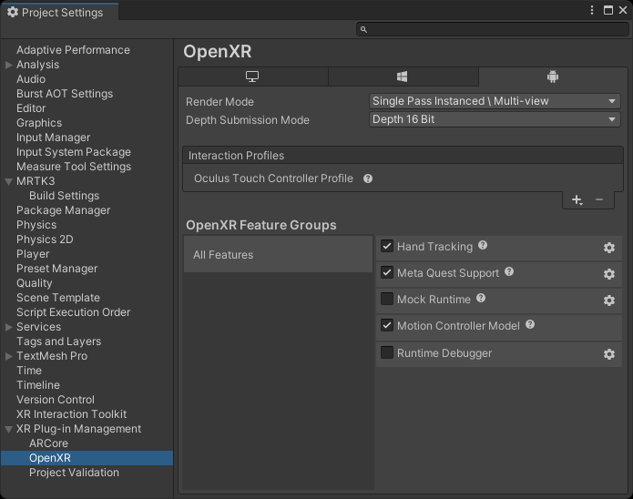

# Deploy an MRTK3 project to a Quest device

This page describes how to deploy your Unity Project with MRTK onto a Quest device. To add MRTK to your project, please refer to the [setup page](../setup.md).

> [!NOTE]
> We **strongly recommend** using [Holographic remoting](/windows/mixed-reality/develop/unity/preview-and-debug-your-app) for rapid iteration and testing on HoloLens 2, which allows for instant testing on the device without the need for compile + deploy. You can also play in Unity directly with the PC's current OpenXR runtime, including [Windows Mixed Reality](https://www.microsoft.com/p/openxr-tools-for-windows-mixed-reality/9n5cvvl23qbt), [SteamVR on OpenXR](https://www.steamvr.com/), or even [Oculus Link for Quest](https://support.oculus.com/airlink). See our complete list [here](../debugging-and-testing.md).

## Deployment Prerequisites

1. Follow [these steps](https://developer.oculus.com/documentation/unity/book-unity-gsg/) to ensure that your project is ready to deploy on the Quest Device.

1. Ensure that [developer mode](https://developer.oculus.com/documentation/native/android/mobile-device-setup/) is enabled on your device. Installing the Oculus ADB Drivers is optional.

1. Navigate to **File > Build Settings**.

1. Under **Platform**, select **Android**. Switch the platform to **Android**.

1. Navigate to **Edit > Project Settings**.

1. Under **Project Settings**, navigate to **XR Plug-in Management** and enable **OpenXR** under the **Android** tab. Ensure that **Initialize XR on Startup** is selected and that no feature groups are enabled.

    

1. Under **Project Settings**, navigate to **XR Plug-in Management > OpenXR > Interaction Profiles** and change it so only **Oculus Touch Controller Profile** is present.

1. Under **Project Settings**, navigate to **XR Plug-in Management > OpenXR > OpenXR Feature Groups** and ensure the following are checked under **All Features**.

    

    > [!NOTE]
    > Red or yellow error/warning icons might appear during this process. Click the icon to open the **OpenXR Project Validation** tool and select **Fix All** to address the issues. You may need to do this several times.

    > [!NOTE]
    > If you don't see **Oculus Quest Support** under the **OpenXR Feature Groups** panel, make sure you've downloaded the Mixed Reality OpenXR Plugin via the [MR Feature Tool](/mixed-reality/develop/unity/welcome-to-mr-feature-tool)

1. If you plan on using the native keyboard, please refer to the [keyboard documentation](../../mrtk3-input/packages/input/System-keyboard.md#meta-quest-specific-setup) for a required `AndroidManifest.xml` modification.

## Deploying to Device

1. After you have the project configured, proceed to [Generate Build](https://developer.oculus.com/documentation/unity/unity-build/#generate-build)

    > [!NOTE]
    > **Do not** follow the Configure Settings instructions on Oculus's documentation page. Their instructions require the use of the Oculus Integration SDK, and uses the Oculus XR Plug-in rather than the OpenXR Plug-in.

    > [!NOTE]
    > We recommend that you select **Build and Run** to build and run your project. This will cause it to deploy  directly to your Oculus Quest.
